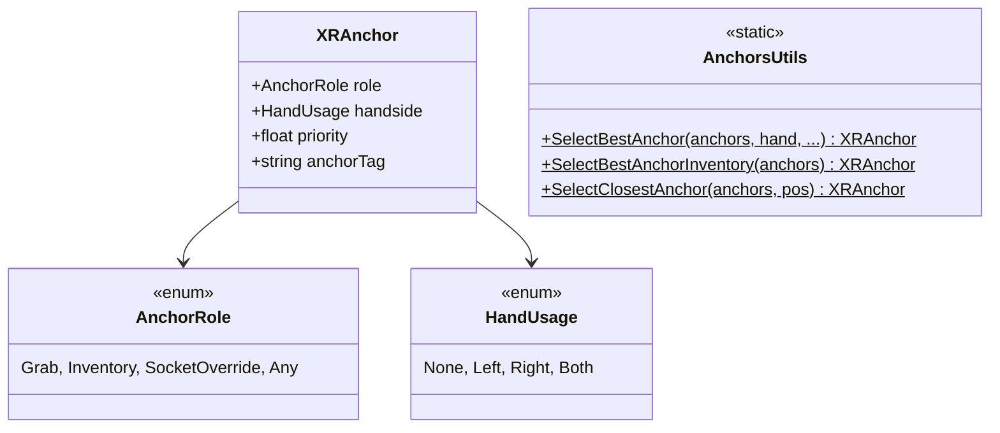

# Anchor System

[Back to README](../README.md)

Smart snap points that define precisely how objects are grabbed, with scoring-based selection.

## Architecture



## Enums

### AnchorRole

`Grab` | `Inventory` | `SocketOverride` | `Any`

### HandUsage

`None` | `Left` | `Right` | `Both`

## XRAnchor (MonoBehaviour)

Place on child GameObjects of a grabbable object. Defines an ideal hand position and rotation.

| Field | Type | Default | Description |
|-------|------|---------|-------------|
| `role` | `AnchorRole` | Any | Anchor purpose |
| `handside` | `HandUsage` | None | Compatible hand(s) |
| `priority` | `float` | 1.0 | Selection weight |
| `anchorTag` | `string` | "" | Custom tag for identification |

**Gizmo fields** (editor visualization):

| Field | Type | Default |
|-------|------|---------|
| `gizmoSphereRadius` | `float` | 0.01 |
| `gizmoForwardLength` | `float` | 0.08 |
| `gizmoUpLength` | `float` | 0.05 |
| `debugSnapRadius` | `float` | 0.12 |

**Gizmo colors:** Cyan = Left, Magenta = Right, Yellow = Both, Gray = None.

## AnchorsUtils (Static)

### SelectBestAnchor

```csharp
static XRAnchor SelectBestAnchor(
    List<XRAnchor> anchors,
    HandUsage hand,
    Vector3 interactorPos,
    Quaternion interactorRot,
    float maxSnapDistance = 0,
    bool useAngle = false,
    float maxAngle = 0f,
    float angleWeight = 0f
)
```

**Scoring algorithm:**
```
Score = (1 - distance/maxDistance) * distWeight
      + (1 - angle/maxAngle) * angleWeight
      + priority * priorityWeight
```

Filters by hand compatibility. Returns anchor with highest score.

### SelectBestAnchorInventory

```csharp
static XRAnchor SelectBestAnchorInventory(List<XRAnchor> anchors)
```

Returns the inventory-role anchor with highest priority.

### SelectClosestAnchor

```csharp
static XRAnchor SelectClosestAnchor(List<XRAnchor> anchors, Vector3 interactorPos)
```

Returns the closest anchor by distance (no filtering).

## Source Files

- `Runtime/Utils/Anchors/XRAnchor.cs`
- `Runtime/Utils/Anchors/AnchorsUtils.cs`
