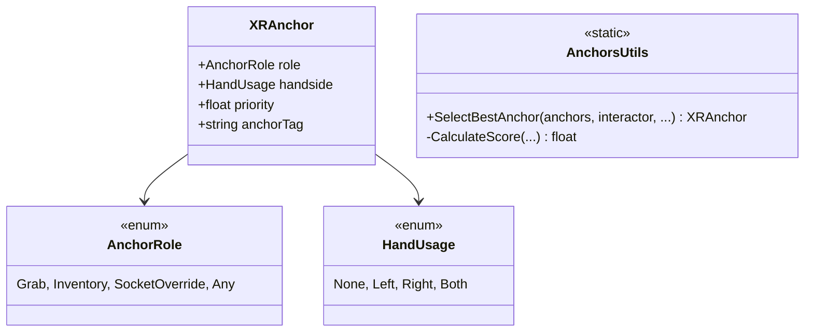

# Système d'Anchors

Système de points d'ancrage intelligents pour définir précisément comment les objets sont saisis.

## Architecture



## XRAnchor

Composant à placer sur des GameObjects enfants de l'objet grabbable. Définit une position et une rotation idéales pour la main.

- **Role** : Définit si cet anchor sert au Grab normal, au stockage dans l'inventaire, ou autre.
- **HandSide** : Restreint l'anchor à une main spécifique (ex: poignée gauche d'un fusil, anse d'une tasse orientée vers la droite).
- **Priority** : Permet de favoriser certains anchors par rapport à d'autres (ex: la poignée principale a une priorité plus haute que le canon).
- **Gizmos** : Visualisation en éditeur pour faciliter le placement (Cyan=Gauche, Magenta=Droite, Jaune=Les deux).

## Algorithme de Sélection (Score)

Lorsqu'une main tente de saisir un objet avec `DirectAnchorLogic`, le système évalue tous les anchors disponibles et calcule un score pour chacun :

```
Score = (1 - distance/maxDistance) * distWeight 
      + (1 - angle/maxAngle) * angleWeight 
      + priority * priorityWeight
```

L'anchor avec le meilleur score est choisi. Cela permet un systéme de grab très fluide où la main "snappe" naturellement vers la poignée la plus proche et la mieux orientée.
