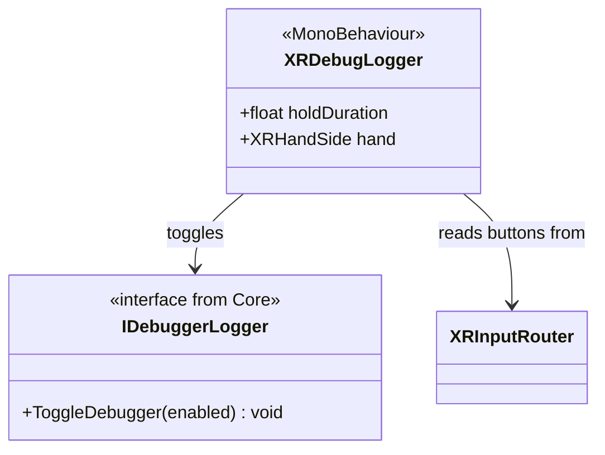

# XR Debug System

[Back to README](../README.md)

Utilities for toggling the in-VR debugger via controller buttons.

## Architecture

## XRDebugLogger (MonoBehaviour)

Toggles the debug panel by holding a button combination.

| Field | Type | Default | Description |
|-------|------|---------|-------------|
| `holdDuration` | `float` | 2.0 | Hold time before toggle |
| `hand` | `XRHandSide` | Left | Which hand to listen on |

### Behavior

Hold **Primary** (A/X) + **Secondary** (B/Y) simultaneously on the configured hand for `holdDuration` seconds to toggle the debug panel on/off.

Finds `IDebuggerLogger` (from `DebugLoggerController`) on the same GameObject at `Awake()`.

## Source Files

- `Runtime/Utils/Debug/XRDebugLogger.cs`
