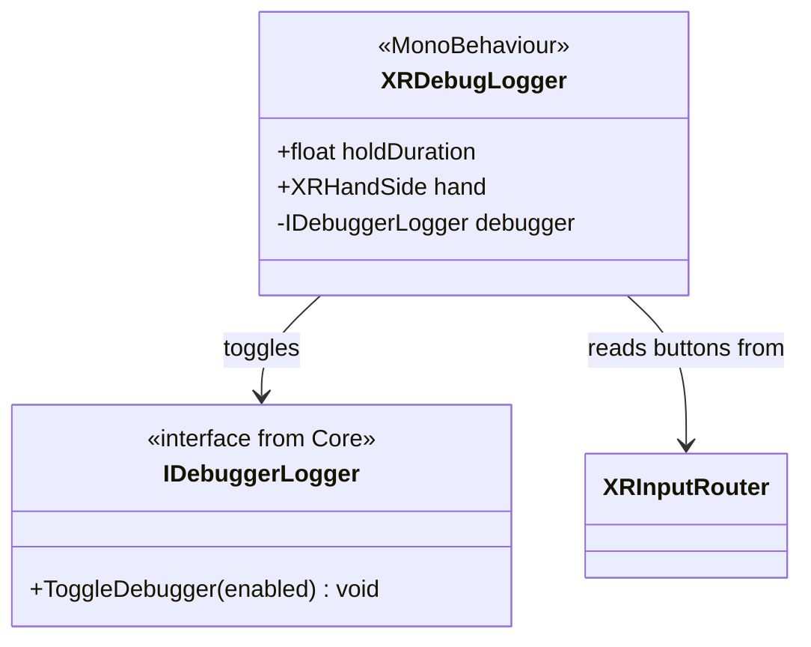

# Debug XR

Utilitaires pour déboguer l'application directement dans le casque VR.

## Architecture

## XRDebugLogger

Composant simple qui écoute une combinaison de boutons spécifique pour activer/désactiver le panneau de logs (`DebugLoggerController` du Core).

- **Activation** : Maintenir les boutons **Primary** (A/X) et **Secondary** (B/Y) de la main configurée simultanément.
- **Hold Duration** : Temps de maintien avant activation (évite les déclenchements accidentels).

Indispensable pour voir les exceptions et logs `Debug.Log` sans retirer le casque.
