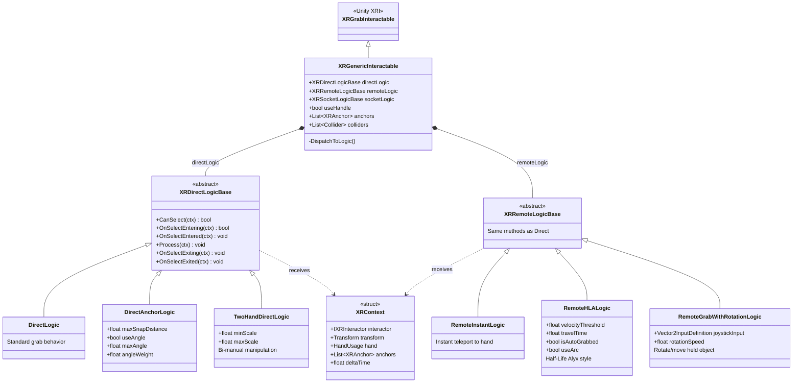

# Système de Grab Avancé

Système modulaire et extensible pour la manipulation d'objets en VR, utilisant le **Strategy Pattern** pour permettre différents comportements de saisie (Direct, Distant, Socket) sur un même objet.

## Architecture



## Composants Principaux

### XRGenericInteractable

L'interactable central qui remplace le `XRGrabInteractable` standard. Il utilise la sérialisation polymorphique (`[SerializeReference]`) pour permettre de configurer des stratégies de grab différentes directement dans l'inspecteur.

- **Types de Grab supportés** : Direct (main), Remote (rayon), Socket (inventaire).
- **Validation** : Vérifie automatiquement la présence de Rigidbody et Colliders.
- **Anchors** : Gère la liste des `XRAnchor` enfants pour le snapping.

### Logiques Direct Grab

Ces logiques définissent comment l'objet se comporte lorsqu'il est saisi directement par la main.

| Logique | Description | Propriétés Clés |
|---------|-------------|-----------------|
| **DirectLogic** | Comportement standard XRI. L'objet suit la main. | Aucune |
| **DirectAnchorLogic** | Snap l'objet à une position précise dans la main (Anchor). | `maxSnapDistance`, `useAngle`, `maxAngle` |
| **TwoHandDirectLogic** | Permet la manipulation à deux mains (scale/rotate). | `minScale`, `maxScale` |

### Logiques Remote Grab

Ces logiques définissent comment l'objet se comporte lorsqu'il est saisi à distance (Ray Interactor).

| Logique | Description | Propriétés Clés |
|---------|-------------|-----------------|
| **RemoteInstantLogic** | Téléportation immédiate dans la main. Pratique pour le loot rapide. | Aucune |
| **RemoteHLALogic** | Lancement en arc type "Half-Life Alyx". L'objet vole vers la main. | `velocityThreshold`, `travelTime`, `useArc` |
| **RemoteGrabWithRotationLogic** | L'objet reste à distance et peut être manipulé/tourné au joystick. | `rotationSpeed`, `joystickInput` |

### XRContext

Structure de données passée à toutes les méthodes de logique (`Process`, `OnSelectEntering`, etc.). Elle évite de passer de multiples paramètres et garantit que la logique a accès au contexte complet de l'interaction.

- `IXRInteractor interactor` : L'interactor qui initie l'action.
- `HandUsage hand` : La main (Gauche/Droite) qui interagit.
- `List<XRAnchor> anchors` : Les points de snap disponibles sur l'objet.

## Exemple d'implémentation

```csharp
using Louis.XR.Interactions.Grab;

public class CustomGrabLogic : XRDirectLogicBase
{
    public float myCustomSpeed = 1.0f;

    public override void Process(XRContext context)
    {
        // Logique exécutée à chaque frame pendant le grab
        context.transform.Rotate(Vector3.up * myCustomSpeed * context.deltaTime);
    }
}
```
