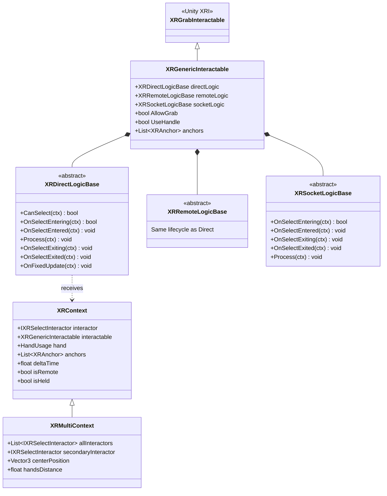

# Grab System

[Back to README](../README.md)

Modular grab system using the **Strategy Pattern** for composable interaction behaviors. Supports direct grab, remote grab (Half-Life Alyx style), two-hand manipulation, socket placement, and door handles.

## Architecture



## XRGenericInteractable

`[DisallowMultipleComponent]` - Extends `XRGrabInteractable`.

Central component that replaces the standard XRGrabInteractable. Uses `[SerializeReference]` for polymorphic logic selection in Inspector.

| Field | Type | Description |
|-------|------|-------------|
| `directLogic` | `XRDirectLogicBase` | Hand-to-object grab strategy |
| `remoteLogic` | `XRRemoteLogicBase` | Distance grab strategy |
| `socketLogic` | `XRSocketLogicBase` | Socket placement strategy |
| `allowGrab` | `bool` | Enable/disable grabbing |
| `onGrabPreset` | `XRHapticPreset` | Haptic on grab |
| `onReleasePreset` | `XRHapticPreset` | Haptic on release |
| `onHoverPreset` | `XRHapticPreset` | Haptic on hover |

Properties: `AllowGrab { get; set; }`, `UseHandle { get; }`.

Auto-collects `XRAnchor` children on `Awake()`.

## XRContext / XRMultiContext

Data objects passed to all logic methods.

**XRContext fields:** `interactor`, `interactable`, `hand` (HandUsage), `interactorPosition`, `interactorRotation`, `attachTransform`, `anchors`, `deltaTime`, `isRemote`, `isHeld`, `manager`.

**XRMultiContext** adds: `allInteractors`, `secondaryInteractor`, `secondaryInteractorPosition`, `secondaryInteractorRotation`, `secondaryHand`, `centerPosition`, `handsDirection`, `handsDistance`, `interactorCount`.

## Direct Grab Logics

| Logic | Description | Key Fields |
|-------|-------------|------------|
| `DirectLogic` | Standard XRI behavior, object follows hand | None |
| `DirectAnchorLogic` | Snaps to nearest anchor with scoring | `maxSnapDistance`, `useAngle`, `maxAngle`, `angleWeight` |
| `TwoHandDirectLogic` | Two-hand manipulation (scale/rotate) | `alignToHandsAxis`, `enableScaling`, `minScale`, `maxScale`, `usePrimaryHandAnchor`, `maxSnapDistance` |

### TwoHandDirectLogic Details

Supports bi-manual manipulation with:
- **Rotation:** Aligns object axis to the line between both hands
- **Scaling:** Distance between hands controls scale (`minScale` to `maxScale`)
- **Anchors:** Primary and secondary hand anchor snapping

Additional methods: `OnSecondHandGrabbed(XRMultiContext)`, `OnSecondHandReleased()`, `ProcessMulti(XRMultiContext)`.

## Remote Grab Logics

| Logic | Description | Key Fields |
|-------|-------------|------------|
| `RemoteInstantLogic` | Instant teleport to hand | None |
| `RemoteHLALogic` | Half-Life Alyx style arc flight | `velocityThreshold`, `travelTime`, `isAutoGrabbed`, `autoGrabDistance`, `useArc`, `arcHeight` |
| `RemoteGrabWithRotationLogic` | Hold at distance, rotate/move with joystick | `joystickInput`, `toggleRotationInput`, `resetInput`, `speed`, `rotationSpeed` |

### RemoteHLALogic Details

1. Object selected via ray
2. Hand flick detected (velocity > `velocityThreshold`)
3. Object flies in parabolic arc toward hand (`travelTime`)
4. On arrival, auto-grabs to direct interactor if `isAutoGrabbed`

### RemoteGrabWithRotationLogic Details

Pushes an input context on grab, pops on release. Uses `Vector2InputDefinition` joystick for distance/rotation control.

## Socket Grab Logic

| Logic | Description |
|-------|-------------|
| `SocketAnchorLogic` | Selects inventory anchor on socket enter, restores default on exit |

## XRHandleInteractable

Extends `XRGrabInteractable`. Specialized for door handles with front/back attach points.

| Field | Type | Description |
|-------|------|-------------|
| `frontHandleAttach` | `Transform` | Front grip position |
| `backHandleAttach` | `Transform` | Back grip position |
| `HandleRoot` | `Transform` | Handle root transform |
| `LHand` / `RHand` | `GameObject` | Static hand models |
| `doorColliders` | `List<Collider>` | Colliders to ignore during grab |

Selects front/back attach based on interactor side. Shows/hides static hand models on grab. Manages collision ignoring between hand and door.

## XRInteractorController

Manages direct/ray/UI interactor switching per hand.

| Field | Type | Description |
|-------|------|-------------|
| `directInteractor` | `XRBaseInteractor` | Direct (hand) interactor |
| `rayInteractor` | `XRBaseInteractor` | Ray (distance) interactor |
| `uiInteractor` | `XRBaseInteractor` | UI interaction interactor |
| `dynamicHand` | `GameObject` | Animated hand model |
| `staticHand` | `GameObject` | Static hand model (for handles) |

Switches between dynamic/static hand on grab/release. Enables handle mode when grabbing `XRHandleInteractable`.

## Extending the Grab System

```csharp
using Louis.XR.Interactions.Grab;
using Louis.XR.Interactions.Grab.Logic;

[System.Serializable]
public class CustomGrabLogic : XRDirectLogicBase
{
    public float speed = 1.0f;

    public override void Process(XRContext ctx)
    {
        ctx.interactable.transform.Rotate(Vector3.up * speed * ctx.deltaTime);
    }
}
```

## Source Files

- `Runtime/Grab/XRGenericInteractable.cs`
- `Runtime/Grab/XRContext.cs`
- `Runtime/Grab/XRMultiContext.cs`
- `Runtime/Grab/XRHandleInteractable.cs`
- `Runtime/Grab/XRInteractorController.cs`
- `Runtime/Grab/Logic/XRDirectLogicBase.cs`
- `Runtime/Grab/Logic/XRRemoteLogicBase.cs`
- `Runtime/Grab/Logic/XRSocketLogicBase.cs`
- `Runtime/Grab/Logic/Direct/DirectLogic.cs`
- `Runtime/Grab/Logic/Direct/DirectAnchorLogic.cs`
- `Runtime/Grab/Logic/Direct/TwoHandDirectLogic.cs`
- `Runtime/Grab/Logic/Remote/RemoteInstantLogic.cs`
- `Runtime/Grab/Logic/Remote/RemoteHLALogic.cs`
- `Runtime/Grab/Logic/Remote/RemoteGrabWithRotationLogic.cs`
- `Runtime/Grab/Logic/Socket/SocketAnchorLogic.cs`
