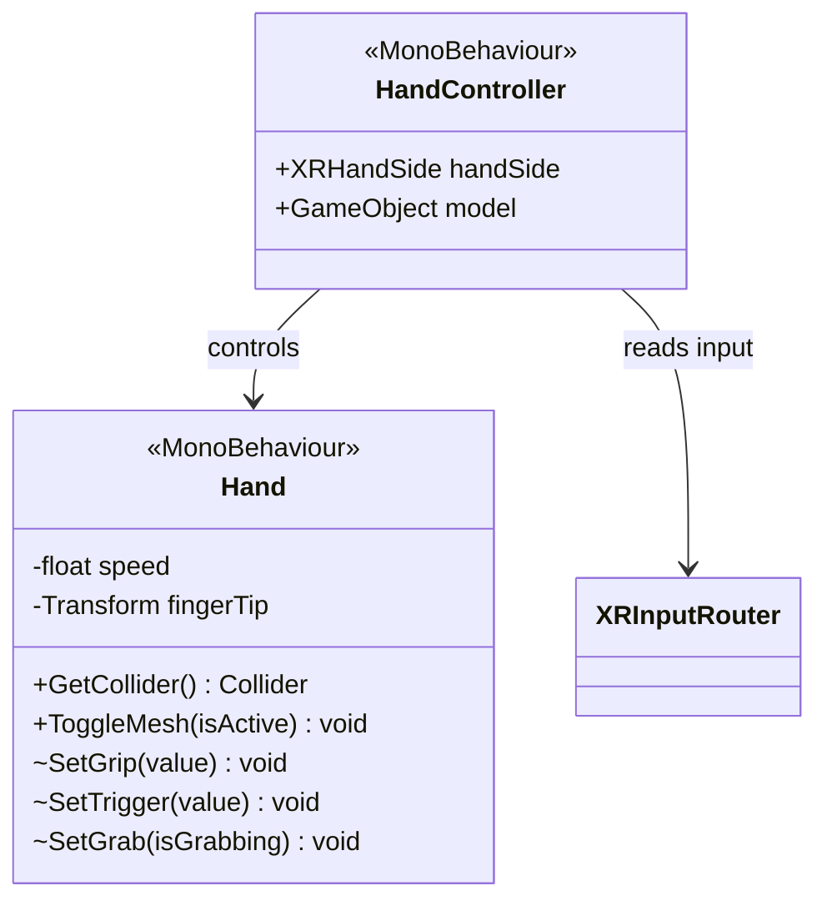

# Hands System

[Back to README](../README.md)

Procedural hand animation synchronized with controller inputs (Grip, Trigger) and interaction state.

## Architecture

## Hand (MonoBehaviour)

`[RequireComponent(typeof(Animator))]`

Visual hand representation managing animation and interactor references.

| Field | Type | Default | Description |
|-------|------|---------|-------------|
| `speed` | `float` | 2.5 | Animation blend speed |
| `fingerTip` | `Transform` | | Fingertip transform for poke |
| `disableCollider` | `bool` | false | Disable hand collider |

**Animator Parameters:**
- `Grip` (float 0-1): Finger curl for grip (middle, ring, pinky)
- `Trigger` (float 0-1): Index finger curl
- `Grab` (bool): Active grab state

**Public Methods:**

| Method | Description |
|--------|-------------|
| `GetCollider()` | Returns hand mesh collider |
| `ToggleMesh(bool)` | Shows/hides hand mesh renderer |

**Internal Methods:** `SetGrip(float)`, `SetTrigger(float)`, `SetGrab(bool)` - Called by HandController.

**Auto-setup in Start():** Creates a `PokeInteractor` child for fingertip interactions.

## HandController (MonoBehaviour)

Bridge between XR inputs and hand animation.

| Field | Type | Default | Description |
|-------|------|---------|-------------|
| `handSide` | `XRHandSide` | Right | Left or Right hand |
| `model` | `GameObject` | | Hand model GameObject |

Reads Grip and Trigger values from `XRInputRouter` each frame. Detects grab state from `XRDirectInteractor` and calls `Hand.SetGrab()`.

## Setup

1. Import a rigged hand model
2. Create an Animator Controller with `Grip`, `Trigger` (float) and `Grab` (bool) parameters
3. Add `Hand` component to the hand mesh
4. Add `HandController` to the controller parent, link the hand

**Data flow:** `XRInputRouter` -> `HandController` -> `Hand` -> `Animator`

## Source Files

- `Runtime/Hands/Scripts/Hand.cs`
- `Runtime/Hands/Scripts/HandController.cs`
