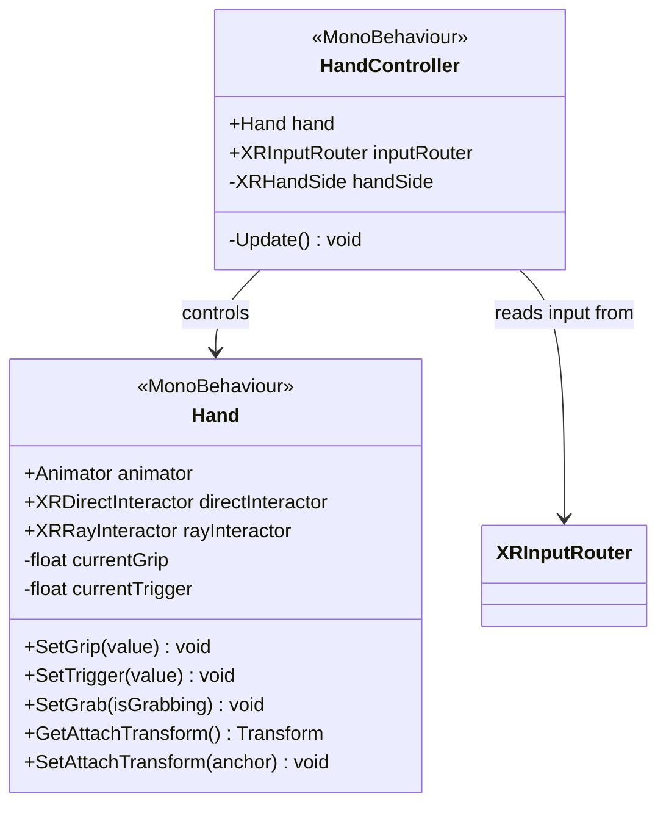

# Système de Mains (Hands)

Système d'animation procédurale pour les mains VR, synchronisé avec les inputs du contrôleur (Grip, Trigger) et l'état d'interaction.

## Architecture

## Composants Principaux

### HandController

Composant "cerveau" qui fait le lien entre les inputs physiques et la représentation visuelle de la main.

- Lit les valeurs via `XRInputRouter` (ou `ActionBasedController`).
- Met à jour les paramètres de l'Animator de la main :
  - `Grip` (0-1) : Saisie (majeur, annulaire, auriculaire).
  - `Trigger` (0-1) : Index.
- Détecte l'état de Grab pour figer la main ou jouer une animation de saisie spécifique.

### Hand

Représentation visuelle de la main. Gère l'Animator et les références aux interactors attachés à cette main.

- **Animation** : Blend Tree mélangeant les états Open, Pinch (Trigger) et Fist (Grip).
- **Attach Transform** : Gère dynamiquement le point d'attache pour que l'objet saisi s'aligne correctement avec la main virtuelle.

## Configuration

Pour configurer une nouvelle main :
1. Importer un modèle de main riggé.
2. Créer un Animator Controller avec des paramètres `Grip` et `Trigger`.
3. Ajouter le script `Hand`.
4. Assigner les références `animator`.
5. Sur le parent (Controller), ajouter `HandController` et lier la main.
