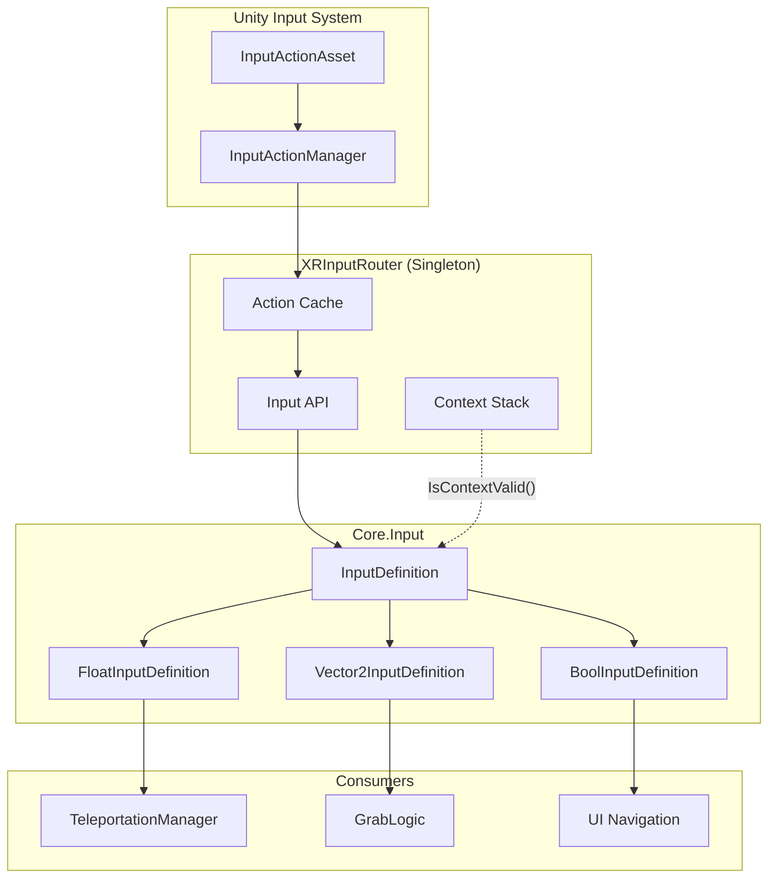
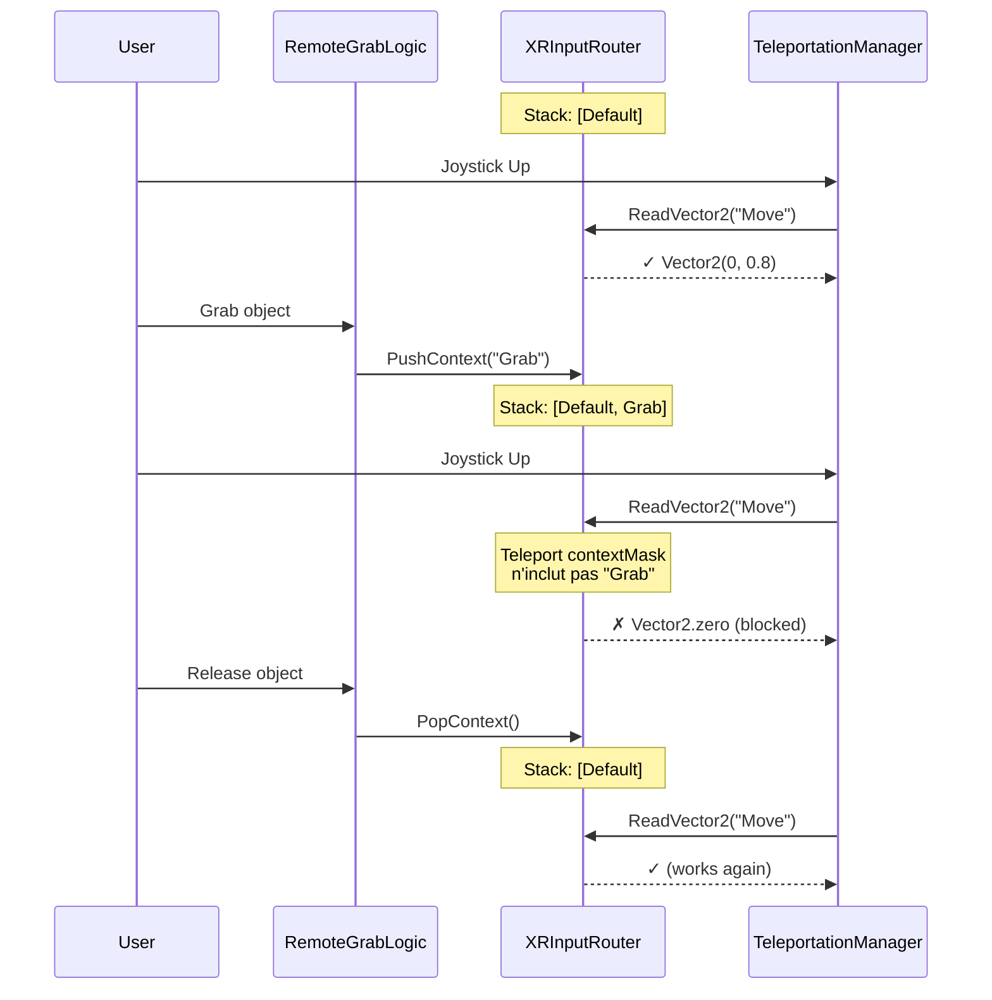
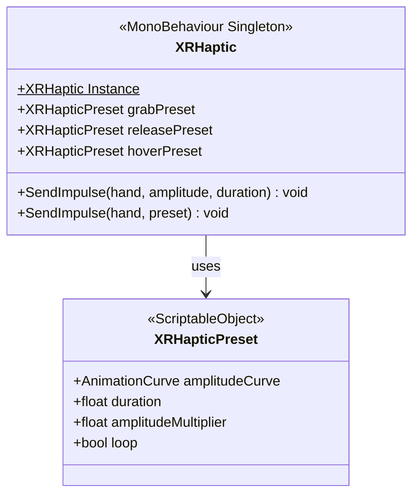

# Système d'Input & Haptique

Routage centralisé des inputs XR et gestion avancée du feedback haptique.

## Architecture Input

Le système repose sur un **Singleton** `XRInputRouter` qui centralise la lecture des actions Unity Input System et offre une interface simplifiée aux autres scripts. Il gère également une pile de contextes (Context Stack) pour résoudre les conflits d'inputs.



### Context Stack (Gestion des conflits)

Le Context Stack permet de bloquer dynamiquement certains inputs selon l'état de l'application (ex: bloquer la locomotion quand on manipule un objet).



## Système Haptique

Système de feedback vibratoire supportant des impulsions simples et des patterns complexes via des courbes d'animation.



### XRHapticPreset

Un ScriptableObject définissant une "sensation" haptique.
- `amplitudeCurve` : Permet de dessiner la variation d'intensité de la vibration dans le temps (ex: battement de coeur, impact sec, montée progressive).
- `loop` : Si vrai, la vibration se répète (utile pour minigun, moteur, etc.).

### Utilisation

```csharp
// Vibration simple
XRHaptic.Instance.SendImpulse(XRHandSide.Right, 0.5f, 0.1f);

// Vibration via Preset
[SerializeField] private XRHapticPreset recoilPreset;
XRHaptic.Instance.SendImpulse(XRHandSide.Right, recoilPreset);
```
