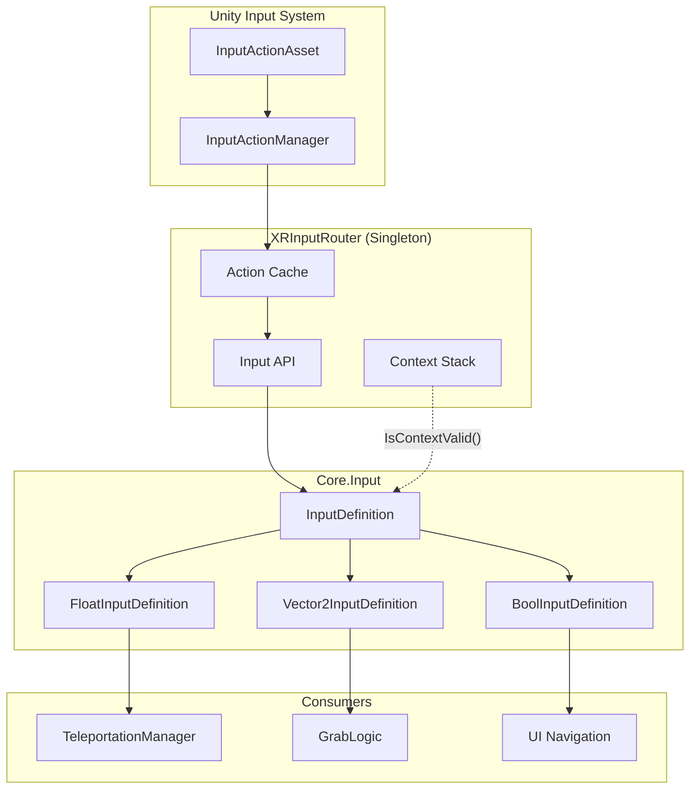
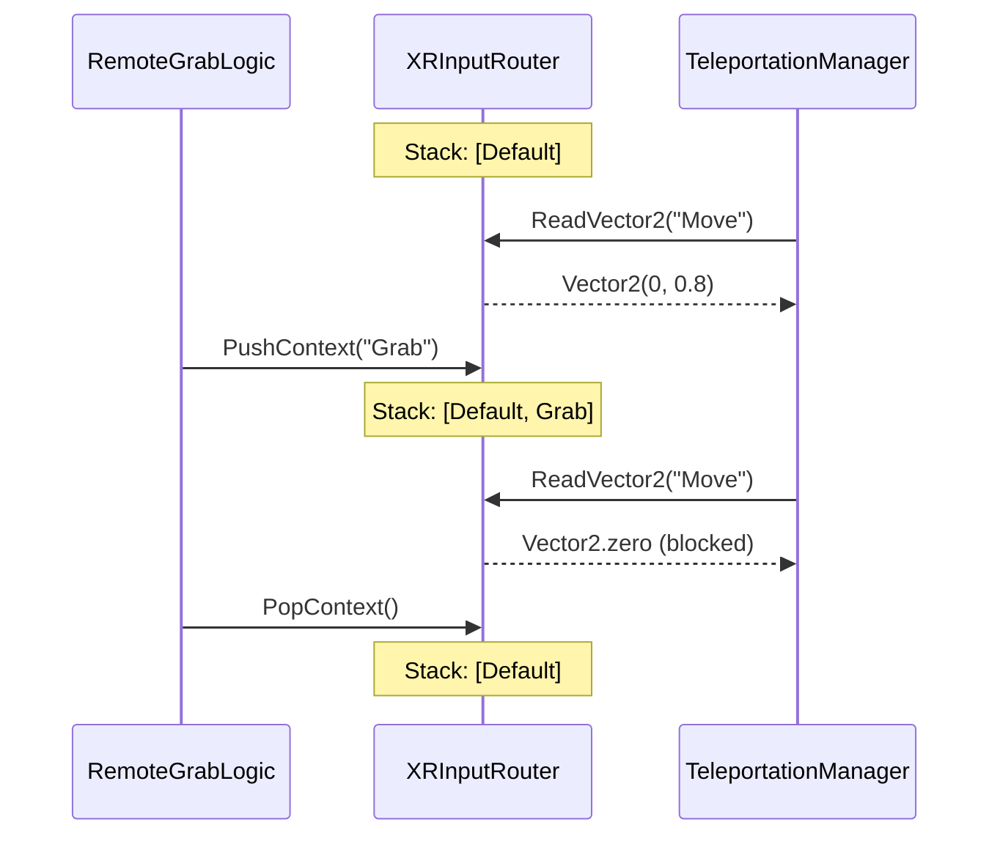
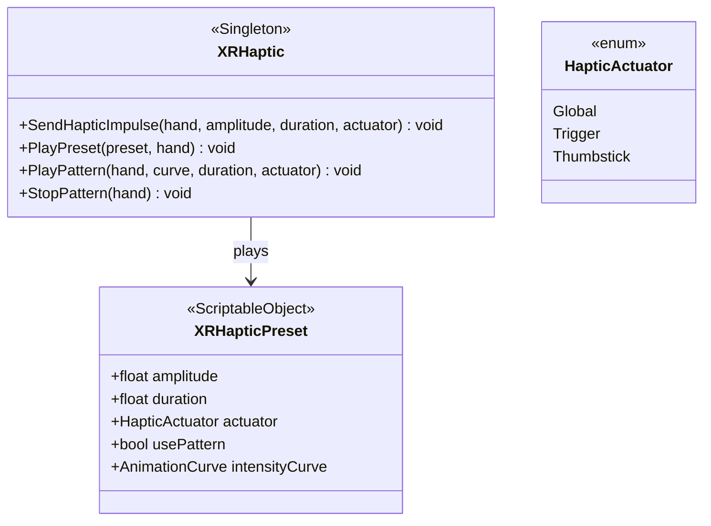

# Input & Haptics System

[Back to README](../README.md)

Centralized XR input routing and haptic feedback management.

## Architecture - Input



## Enums

### XRHandSide

`Left = 0` | `Right = 1`

### XRButtonType

`Primary` | `Secondary` | `Trigger` | `Grip` | `Menu`

## XRInputRouter (Singleton)

`[DefaultExecutionOrder(-100)]` - Implements `IInputSource`.

Centralizes all XR input reading. Auto-detects `InputActionManager` and caches all actions on `Awake()`.

### Input Reading

**Trigger:**
| Method | Signature |
|--------|-----------|
| `TriggerValue` | `float (XRHandSide)` |
| `TriggerPressed` | `bool (XRHandSide, float th = 0.5f)` |
| `TriggerTouched` | `bool (XRHandSide)` |

**Grip:**
| Method | Signature |
|--------|-----------|
| `GripValue` | `float (XRHandSide)` |
| `GripPressed` | `bool (XRHandSide, float th = 0.5f)` |
| `GripTouched` | `bool (XRHandSide)` |

**Primary (A/X):**
| Method | Signature |
|--------|-----------|
| `PrimaryPressedThisFrame` | `bool (XRHandSide)` |
| `PrimaryHeld` | `bool (XRHandSide)` |
| `PrimaryTouched` | `bool (XRHandSide)` |

**Secondary (B/Y):**
| Method | Signature |
|--------|-----------|
| `SecondaryPressedThisFrame` | `bool (XRHandSide)` |
| `SecondaryHeld` | `bool (XRHandSide)` |
| `SecondaryTouched` | `bool (XRHandSide)` |

**Thumbstick:**
| Method | Signature |
|--------|-----------|
| `Thumbstick` | `Vector2 (XRHandSide)` |
| `ThumbstickClicked` | `bool (XRHandSide)` |

**Menu:**
| Method | Signature |
|--------|-----------|
| `MenuPressedThisFrame` | `bool (XRHandSide)` |
| `MenuHeld` | `bool (XRHandSide)` |

### IInputSource Implementation

| Method | Signature |
|--------|-----------|
| `ReadFloat` | `float (string inputName, int channel = 0)` |
| `ReadVector2` | `Vector2 (string inputName, int channel = 0)` |
| `ReadBool` | `bool (string inputName, int channel = 0)` |

`SourceName` returns `"XR Controllers"`. `IsActive` returns `Instance != null`.

### Context Stack

Manages input context filtering. When a context is pushed, `InputDefinition` instances whose `ContextMask` doesn't include the current context are blocked.



| Method | Signature |
|--------|-----------|
| `PushContext` | `static void (int contextIndex)` |
| `PopContext` | `static void ()` |
| `ClearContextStack` | `static void ()` |

### Button Callbacks

Register callbacks for button press events:

| Method | Signature |
|--------|-----------|
| `RegisterButtonPress` | `void (XRButtonType, XRHandSide, Action)` |
| `UnregisterButtonPress` | `void (XRButtonType, XRHandSide, Action)` |

Convenience methods: `RegisterPrimaryButtonPress`, `RegisterSecondaryButtonPress`, `RegisterTriggerPress`, `RegisterGripPress`, `RegisterMenuPress` (and matching Unregister variants).

### InputDefinition Integration

| Method | Signature |
|--------|-----------|
| `Register` | `static void (InputDefinition)` |
| `Unregister` | `static void (InputDefinition)` |
| `GetAvailableInputNames` | `static string[]` |
| `GetAvailableInputsWithTypes` | `static InputActionInfo[]` |
| `GetActiveInputCount` | `static int` |
| `DumpDebugInfo` | `static void` |

### Haptic Device Access

| Method | Signature |
|--------|-----------|
| `GetHapticDevice` | `InputDevice (XRHandSide)` |
| `GetHapticTrigger` | `InputDevice (XRHandSide)` |
| `GetHapticThumbstick` | `InputDevice (XRHandSide)` |

### Configuration

| Field | Type | Default | Description |
|-------|------|---------|-------------|
| `contextSettings` | `InputContextSettings` | | Context configuration |
| `enableDebugLogs` | `bool` | false | Verbose logging |
| `showDebugInfo` | `bool` | false | Display input state |
| `leftMapName` | `string` | "LouisXR LeftHand" | Left action map name |
| `rightMapName` | `string` | "LouisXR RightHand" | Right action map name |

---

## Architecture - Haptics



### HapticActuator (Enum)

`Global` | `Trigger` | `Thumbstick`

## XRHaptic (Singleton)

### Preset Fields

| Field | Type | Description |
|-------|------|-------------|
| `onGrabPreset` | `XRHapticPreset` | Played on grab |
| `onReleasePreset` | `XRHapticPreset` | Played on release |
| `onHoverPreset` | `XRHapticPreset` | Played on hover |
| `onCollisionPreset` | `XRHapticPreset` | Played on collision |
| `onButtonPressPreset` | `XRHapticPreset` | Played on button press |

### Methods

| Method | Signature |
|--------|-----------|
| `SendHapticImpulse` | `void (XRHandSide, float amplitude, float duration, HapticActuator = Global)` |
| `SendHapticImpulseBothHands` | `void (float amplitude, float duration, HapticActuator = Global)` |
| `PlayPreset` | `void (XRHapticPreset, XRHandSide)` |
| `PlayPresetBothHands` | `void (XRHapticPreset)` |
| `PlayPattern` | `void (XRHandSide, AnimationCurve, float duration, HapticActuator = Global)` |
| `StopPattern` | `void (XRHandSide)` |
| `StopAllPatterns` | `void ()` |

**Convenience:** `PlayGrabFeedback`, `PlayReleaseFeedback`, `PlayHoverFeedback`, `PlayCollisionFeedback`, `PlayButtonPressFeedback` - all take `XRHandSide`.

## XRHapticPreset (ScriptableObject)

**Create:** `Create > XR Interactions > Haptic Preset`

| Field | Type | Default | Description |
|-------|------|---------|-------------|
| `amplitude` | `float [0-1]` | 0.5 | Vibration intensity |
| `duration` | `float [0-1]` | 0.1 | Duration in seconds |
| `actuator` | `HapticActuator` | Global | Target actuator |
| `usePattern` | `bool` | false | Use AnimationCurve pattern |
| `intensityCurve` | `AnimationCurve` | Linear(0,1,1,0) | Intensity over time |
| `presetName` | `string` | "Default" | Display name |
| `description` | `string` | | Description (TextArea) |

Methods: `Play(XRHandSide)`, `PlayBothHands()`. Context menu test actions available in Editor.

## Usage

```csharp
// Simple impulse
XRHaptic.Instance.SendHapticImpulse(XRHandSide.Right, 0.5f, 0.1f);

// Preset
[SerializeField] private XRHapticPreset recoilPreset;
XRHaptic.Instance.PlayPreset(recoilPreset, XRHandSide.Right);

// Input reading
float trigger = XRInputRouter.Instance.TriggerValue(XRHandSide.Right);
Vector2 stick = XRInputRouter.Instance.Thumbstick(XRHandSide.Left);

// Button callback
XRInputRouter.Instance.RegisterPrimaryButtonPress(XRHandSide.Left, OnPrimary);

// Context management
XRInputRouter.PushContext(4); // "Grab" context index
// ... grab logic ...
XRInputRouter.PopContext();
```

## Source Files

- `Runtime/Input/XRInputRouter.cs`
- `Runtime/Input/XRHaptic.cs`
- `Runtime/Input/XRHapticPreset.cs`
