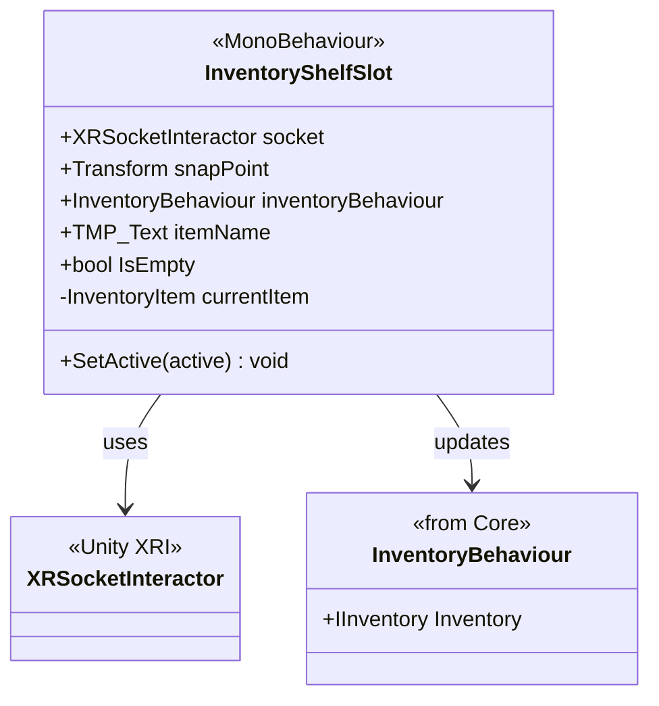

# Système d'Inventaire XR

Intégration VR du système d'inventaire `Louis.Core.Inventory`. Permet de stocker physiquement des objets dans des slots (sockets) et de synchroniser l'état avec le système de données.

## Architecture

## Composants Principaux

### InventoryShelfSlot

Un slot physique dans le monde (ex: sur une ceinture, dans un sac à dos, sur une étagère).
- Utilise un **XRSocketInteractor** pour attirer et fixer les objets.
- Détecte l'objet entré et tente de l'ajouter à l'inventaire logique via `InventoryBehaviour`.
- Si l'ajout à l'inventaire échoue (inventaire plein), l'objet est rejeté.
- Si l'ajout réussit, l'objet est "stocké" (désactivé ou gardé dans le socket selon la configuration).

## Workflow

1. Le joueur relâche un `InventoryItem` près du slot.
2. Le `XRSocketInteractor` capture l'objet.
3. `InventoryShelfSlot` reçoit l'event `SelectEntered`.
4. Il récupère la définition de l'item (`InventoryItemDefinition`) depuis l'objet.
5. Il appelle `inventoryBehaviour.Inventory.TryAdd(item, 1)`.
6. Si OK : L'objet est logiquement dans l'inventaire.
7. Si KO : L'objet est éjecté du socket.
