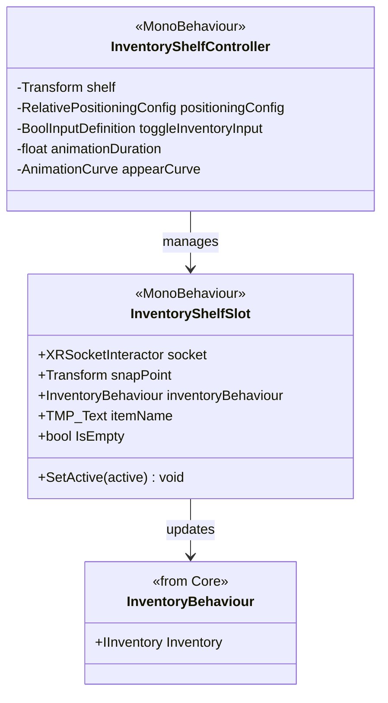

# XR Inventory System

[Back to README](../README.md)

VR integration of the `Louis.Core.Inventory` system. Provides physical slots (sockets) for storing items and a shelf controller for positioning/animation.

## Architecture

## InventoryShelfSlot (MonoBehaviour)

A physical slot in the world (belt, backpack, shelf).

| Field | Type | Description |
|-------|------|-------------|
| `socket` | `XRSocketInteractor` | Socket that attracts items |
| `snapPoint` | `Transform` | Snap position |
| `inventoryBehaviour` | `InventoryBehaviour` | Logical inventory reference |
| `itemName` | `TMP_Text` | Item name display |

**Properties:** `bool IsEmpty { get; }`
**Methods:** `void SetActive(bool active)` - Enable/disable item grab.

### Workflow

1. Player releases an `InventoryItem` near the slot
2. `XRSocketInteractor` captures the object
3. Slot receives `SelectEntered` event
4. Reads `InventoryItemDefinition` from the object
5. Calls `inventoryBehaviour.Inventory.TryAdd(item, 1)`
6. **Success:** Item stored in inventory
7. **Failure:** Item ejected from socket (or redirected to empty slot)

## InventoryShelfController (MonoBehaviour)

Controls shelf visibility, positioning, and animation.

| Field | Type | Default | Description |
|-------|------|---------|-------------|
| `shelf` | `Transform` | | Shelf root transform |
| `positioningConfig` | `RelativePositioningConfig` | | Positioning relative to head |
| `useHeadReference` | `bool` | true | Use camera as reference |
| `animationDuration` | `float` | 0.3 | Show/hide animation time |
| `appearCurve` | `AnimationCurve` | EaseInOut | Animation curve |
| `handType` | `XRHandSide` | Left | Input hand |
| `toggleInventoryInput` | `BoolInputDefinition` | | Toggle button input |

**Property:** `Transform ReferenceTransform { get; }` - Returns camera or rig transform.

Toggle input opens/closes the shelf with a scale animation. Uses `RelativePositioning` from core package for smooth follow.

## Source Files

- `Runtime/Inventory/InventoryShelfSlot.cs`
- `Runtime/Inventory/InventoryShelfController.cs`
