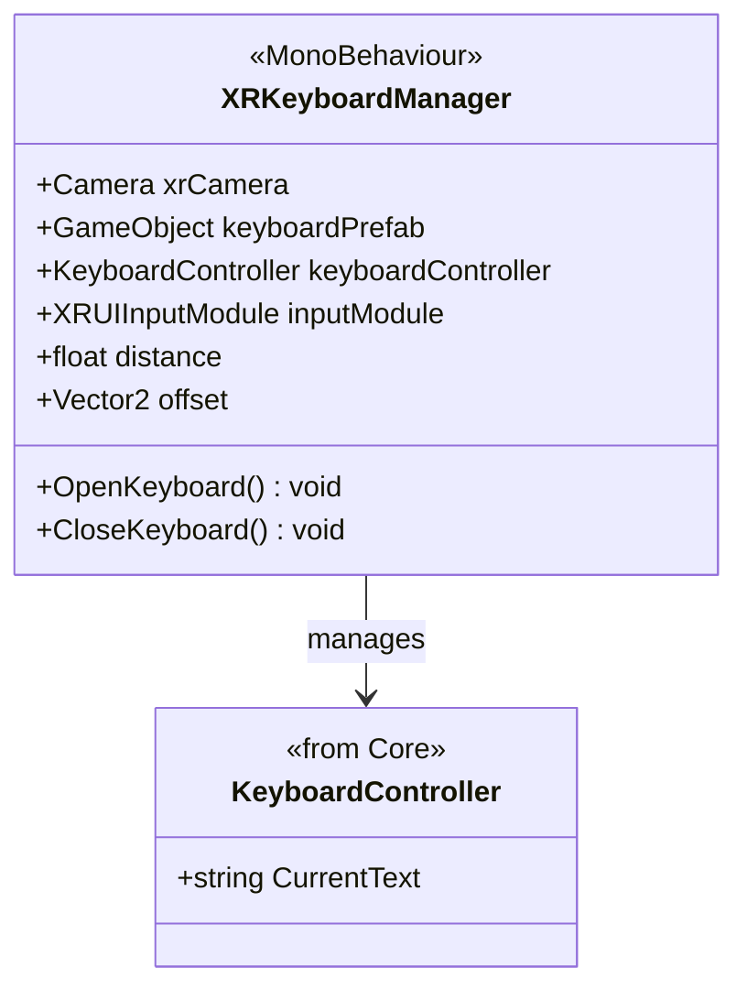

# XR Keyboard System

[Back to README](../README.md)

Auto-positioned virtual keyboard for VR text input.

## Architecture

## XRKeyboardManager (MonoBehaviour)

Handles keyboard appearance and positioning in VR.

| Field | Type | Default | Description |
|-------|------|---------|-------------|
| `xrCamera` | `Camera` | | VR camera reference |
| `keyboardPrefab` | `GameObject` | | Keyboard prefab |
| `keyboardController` | `KeyboardController` | | Controller from core |
| `inputModule` | `XRUIInputModule` | | XR UI input module |
| `distance` | `float` | 0.5 | Distance from camera |
| `offset` | `Vector2` | (0, -0.2) | Position offset (x, y) |

**Methods:**
| Method | Description |
|--------|-------------|
| `OpenKeyboard()` | Shows and positions keyboard |
| `CloseKeyboard()` | Hides keyboard |

**Auto-detection:** Listens for pointer events on `TMP_InputField` elements. When a field is clicked, the keyboard appears in front of the VR camera at the configured distance. Text input is synchronized with the active field.

## Setup

1. Add `XRKeyboardManager` to the scene (on Rig or global manager)
2. Assign keyboard prefab (containing `KeyboardController`)
3. Assign VR camera
4. `TMP_InputField` in World Space Canvas will auto-trigger the keyboard on click

## Source Files

- `Runtime/Keyboard/XRKeyboardManager.cs`
