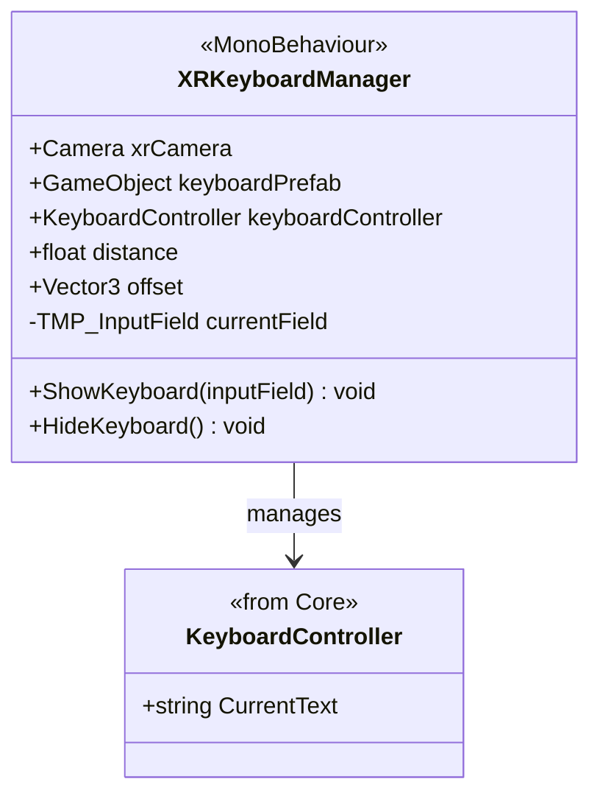

# Clavier XR

Système d'affichage de clavier virtuel en réalité virtuelle, s'adaptant à la position de l'utilisateur.

## Architecture

## XRKeyboardManager

Composant responsable de l'apparition et du positionnement du clavier.

- **Auto-détection** : Écoute les événements de sélection sur les `TMP_InputField` (via `XRUIInputModule` ou système d'event Unity).
- **Positionnement** : Fait apparaître le clavier devant la caméra VR (`xrCamera`) à une `distance` configurée, orienté vers l'utilisateur.
- **Synchronisation** : Tout ce qui est tapé sur le clavier virtuel (`KeyboardController` du Core) est injecté dans le `currentField` actif.

## Utilisation

1. Ajouter `XRKeyboardManager` à la scène (souvent sur le Rig ou un manager global).
2. Assigner le prefab du clavier (contenant le script `KeyboardController`).
3. Assigner la caméra VR.
4. Les champs de texte `TMP_InputField` dans les Canvas (World Space) déclencheront automatiquement le clavier lorsqu'ils sont cliqués.
