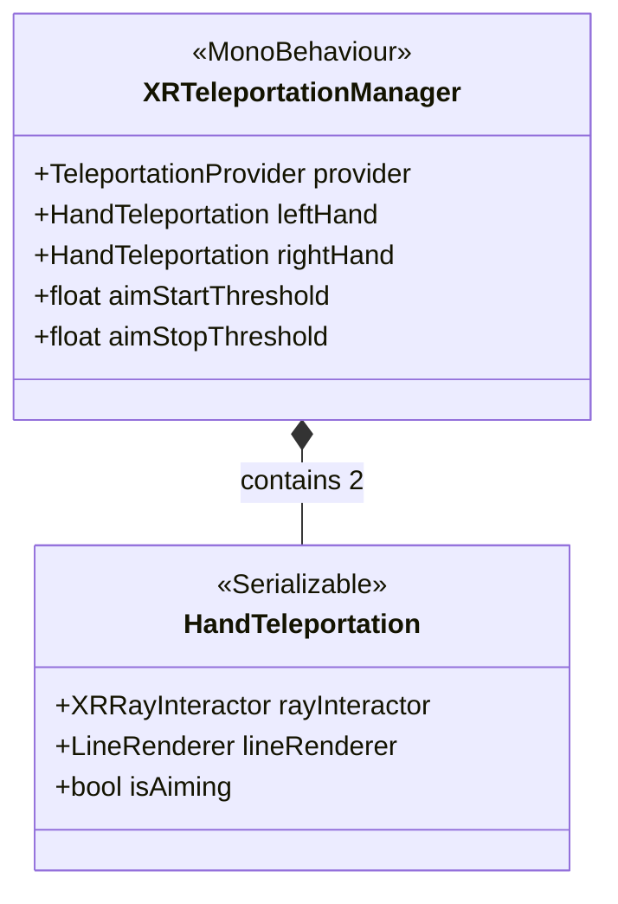

# Système de Téléportation

Locomotion par téléportation standard, activée par le joystick.

## Architecture

## XRTeleportationManager

Gère la machine à état de la téléportation pour chaque main.

- **Aim Start** : Pousser le joystick vers le haut (axe Y > `aimStartThreshold` ~0.7). Active le Ray Interactor de téléportation.
- **Aiming** : Le rayon est visible, l'utilisateur vise une zone de téléportation valide.
- **Execute** : Relâcher le joystick (axe Y < `aimStopThreshold` ~0.2). Si la cible est valide, demande au `TeleportationProvider` Unity de déplacer le XR Origin.
- **Cancel** : Si le joystick est ramené au centre sans cible valide, ou si on appuie sur le Grip (optionnel selon config), l'action est annulée.

Supporte la téléportation double main (chaque main peut initier indépendamment).
