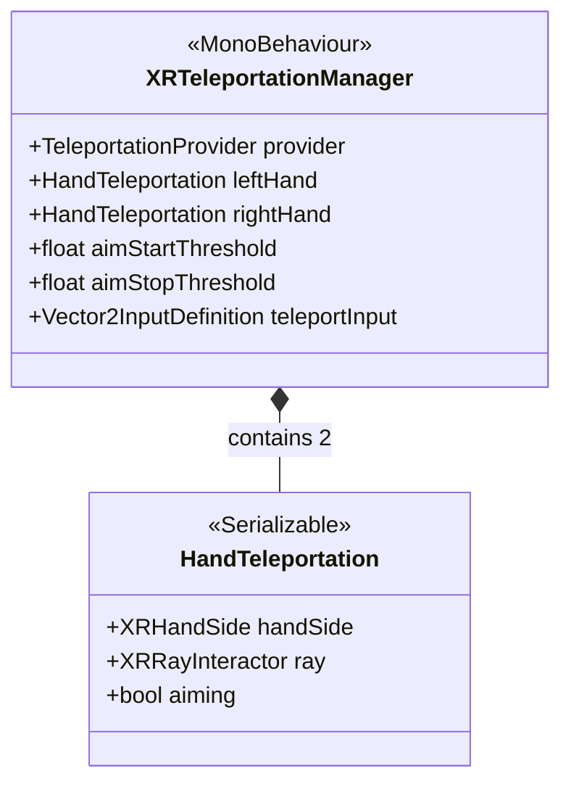

# Teleportation System

[Back to README](../README.md)

Joystick-based teleportation locomotion with per-hand support.

## Architecture

## XRTeleportationManager (MonoBehaviour)

Manages teleportation state machine for each hand.

| Field | Type | Default | Description |
|-------|------|---------|-------------|
| `provider` | `TeleportationProvider` | | Unity teleportation provider |
| `leftHand` | `HandTeleportation` | | Left hand configuration |
| `rightHand` | `HandTeleportation` | | Right hand configuration |
| `aimStartThreshold` | `float` | 0.7 | Joystick Y to start aiming |
| `aimStopThreshold` | `float` | 0.2 | Joystick Y to execute teleport |
| `teleportInput` | `Vector2InputDefinition` | | Input for thumbstick reading |

### State Machine

1. **Idle:** Joystick Y < `aimStartThreshold`
2. **Aim Start:** Joystick Y > `aimStartThreshold` -> Enable ray interactor
3. **Aiming:** Ray visible, user aims at valid teleport area
4. **Execute:** Joystick Y < `aimStopThreshold` -> Teleport if valid target, disable ray
5. **Cancel:** No valid target when released

Each hand operates independently.

### HandTeleportation (Nested Class)

| Field | Type | Description |
|-------|------|-------------|
| `handSide` | `XRHandSide` | Left or Right |
| `ray` | `XRRayInteractor` | Ray interactor for this hand |
| `aiming` | `bool` | Current aiming state (hidden) |

## Source Files

- `Runtime/Teleport/Scripts/TeleportationManager.cs`
