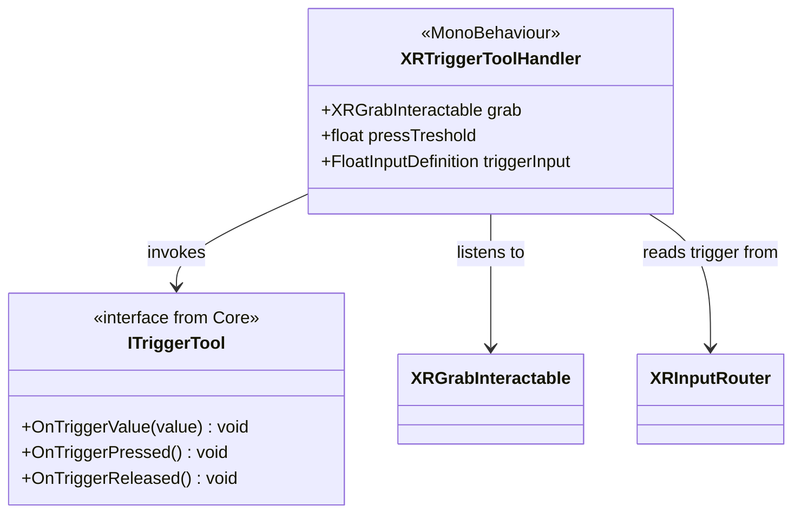

# XR Tools System

[Back to README](../README.md)

Bridge between logical tools (`ITriggerTool` from core) and physical VR interactions.

## Architecture

## XRTriggerToolHandler (MonoBehaviour)

`[DisallowMultipleComponent]`

Place on a grabbable tool object alongside an `ITriggerTool` implementation.

| Field | Type | Default | Description |
|-------|------|---------|-------------|
| `grab` | `XRGrabInteractable` | Auto-found | Grab component |
| `pressTreshold` | `float` | 0.1 | Trigger press threshold |
| `triggerInput` | `FloatInputDefinition` | "Trigger" | Trigger input definition |

### Behavior

1. **On grab (`SelectEntered`):** Detects which hand (Left/Right) holds the object
2. **Every frame while held:** Reads trigger value from `XRInputRouter` for that hand
3. **Transmits:** Calls `ITriggerTool.OnTriggerValue(float)` each frame
4. **Press/Release:** Detects threshold crossings, calls `OnTriggerPressed()` / `OnTriggerReleased()`
5. **On release:** Resets state

This allows creating VR-agnostic tools in core and making them "VR-ready" by adding this single component.

## Source Files

- `Runtime/Tools/XRTriggerToolHandler.cs`
