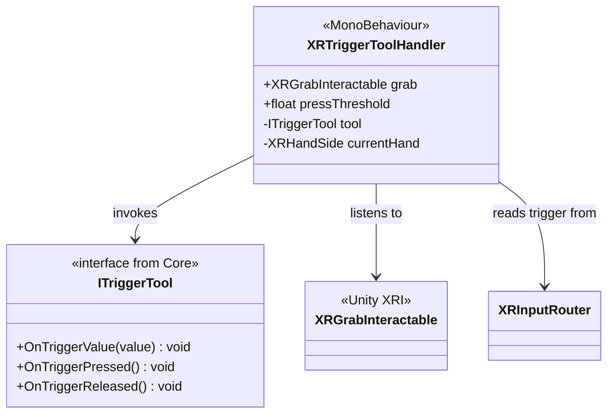

# Outils XR

Pont entre les outils logiques (`ITriggerTool` du Core) et les interactions physiques VR.

## Architecture

## XRTriggerToolHandler

Ce composant se place sur un objet qui est à la fois `XRGrabInteractable` et un outil (ex: `FlashLightTool`).

- **Détection de main** : Quand l'objet est saisi (`SelectEntered`), il note quelle main (Gauche/Droite) le tient.
- **Lecture Input** : À chaque frame, il lit la valeur du Trigger de cette main via `XRInputRouter`.
- **Transmission** : Il transmet la valeur et les états (Pressed/Released) à l'interface `ITriggerTool` présente sur le même GameObject.

Cela permet de créer des outils agnostiques de la VR dans le Core, et de les rendre "VR-ready" simplement en ajoutant ce composant.
