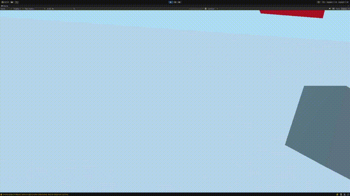
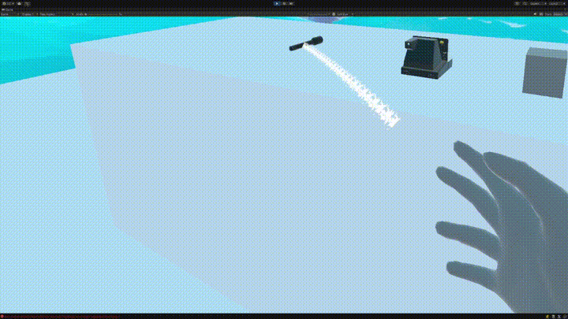

# Louis - XR Interactions

Unity package providing an advanced VR interaction system built on top of the XR Interaction Toolkit.

## Version

**0.0.1**

## Prerequisites

- Unity 2022.3 or higher
- XR Interaction Toolkit 3.2.2
- OpenXR >= 1.8.0
- [com.louis.core](../com.louis.core/README.md) 0.0.1

## Installation

1. Install `com.louis.core` first
2. Open Package Manager in Unity
3. Select "Add package from disk..."
4. Navigate to this package's `package.json`

## Demo

<p align="center">
  
  <span style="display:inline-block; width:20px;"></span>
  
</p>

## Systems

| System | Description | Documentation |
|--------|-------------|---------------|
| **Grab** | Modular grab system (Direct, Remote HLA, Two-Hand, Socket) | [Documentation](Documentation/Grab.md) |
| **Hands** | Procedural hand animation (Grip/Trigger blend) | [Documentation](Documentation/Hands.md) |
| **Input** | Centralized XR input router, Context Stack, Haptics | [Documentation](Documentation/Input.md) |
| **Anchors** | Smart snap points for grab positioning | [Documentation](Documentation/Anchors.md) |
| **Teleportation** | Joystick-based teleportation locomotion | [Documentation](Documentation/Teleportation.md) |
| **Inventory XR** | Physical slots (sockets) with shelf controller | [Documentation](Documentation/Inventory.md) |
| **Keyboard XR** | Auto-positioned virtual keyboard | [Documentation](Documentation/Keyboard.md) |
| **Tools XR** | Bridge for trigger-activated tools | [Documentation](Documentation/Tools.md) |
| **Debug XR** | In-VR debugger activation | [Documentation](Documentation/Debug.md) |

## Package Structure

```
com.louis.xr.interactions/
├── Runtime/
│   ├── Grab/              # Modular grab system + logics
│   ├── Hands/             # Hand animation
│   ├── Input/             # Input routing + haptics
│   ├── Inventory/         # XR inventory
│   ├── Keyboard/          # XR keyboard
│   ├── Teleport/          # Teleportation
│   ├── Tools/             # XR tools
│   └── Utils/
│       ├── Anchors/       # Anchor system
│       ├── Debug/         # XR debug
│       └── Rig/           # XR rig reference
├── Editor/
│   ├── Grab/              # Custom grab editors
│   ├── Input/             # Input router editor
│   └── Utils/             # Utility editors
├── Documentation/
└── Samples~/
```

## Samples

| Sample | Contents |
|--------|----------|
| **Rig** | Pre-configured XR Origin with hands, input, haptics |
| **Door** | HingeOpenable + XRHandleInteractable setup |
| **Teleportation** | Teleportation provider and areas |
| **Inventory** | Shelf slots with inventory behaviour |

**Import:** Package Manager > Louis XR Interactions > Samples > Import

## Namespaces

| Namespace | Contents |
|-----------|----------|
| `Louis.XR.Interactions.Grab` | Grab system and context |
| `Louis.XR.Interactions.Grab.Logic` | Grab logic base classes |
| `Louis.XR.Interactions.Grab.Logic.Direct` | Direct grab logics |
| `Louis.XR.Interactions.Grab.Logic.Remote` | Remote grab logics |
| `Louis.XR.Interactions.Grab.Logic.Socket` | Socket grab logics |
| `Louis.XR.Interactions.Input` | XRInputRouter, XRHandSide, XRButtonType |
| `Louis.XR.Interactions.Input.Feedback` | XRHaptic, XRHapticPreset |
| `Louis.XR.Interactions.Hands` | Hand, HandController |
| `Louis.XR.Interactions.Inventory` | InventoryShelfSlot, InventoryShelfController |
| `Louis.XR.Interactions.Locomotion` | XRTeleportationManager |
| `Louis.XR.Interactions.Keyboard` | XRKeyboardManager |
| `Louis.XR.Interactions.Tools` | XRTriggerToolHandler |
| `Louis.XR.Interactions.Utils.Anchors` | XRAnchor, AnchorsUtils |
| `Louis.XR.Interactions.Utils.Debugger` | XRDebugLogger |
| `Louis.XR.Interactions.Utils.Rig` | XRRigReference |

## License

MIT

## Author

Louis

## Changelog

See [CHANGELOG.md](CHANGELOG.md)
